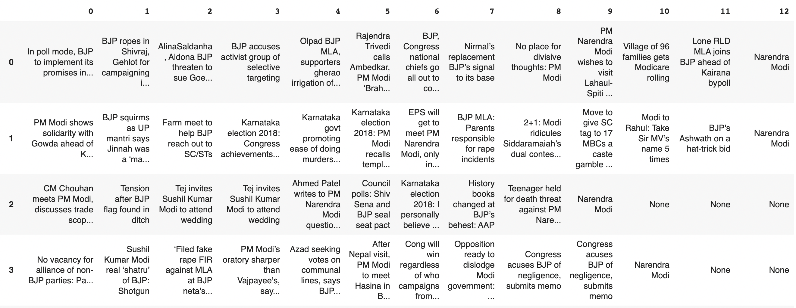

# TOI Headlines
 **[Code](Institutionsassignment_1.ipynb)**
 
I scraped headlines from the Times of India over a period of 12 months immediately leading up to the 2019 national elections. I limited the headlines scraped to those that contained mentions of either the two main parties or their respective contenders for the Prime Minister's post. 

